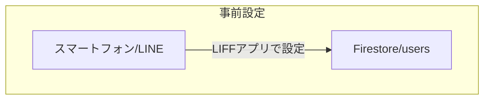
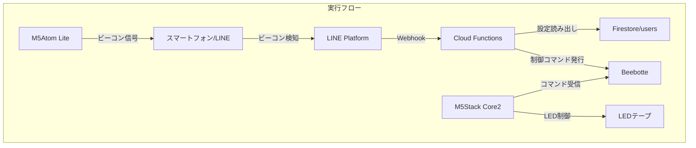
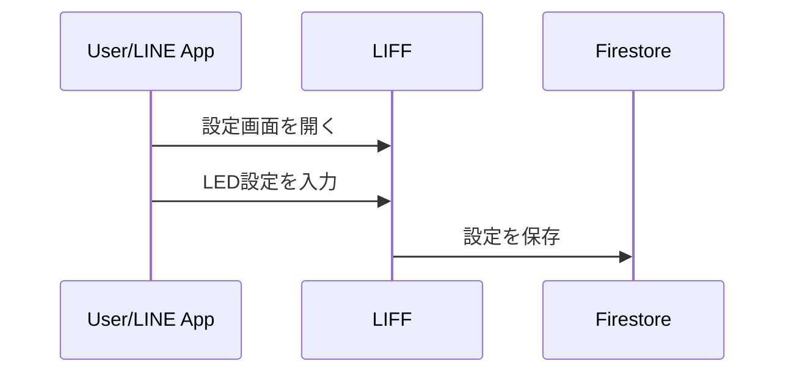
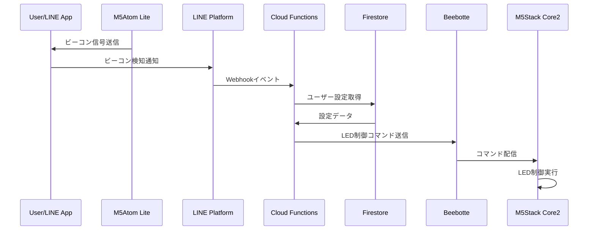

# システム設計書

## 1. システムアーキテクチャ

### 1.1 全体構成

システムの全体構成は、事前設定フローと実行フローに分かれる。

#### 1.1.1 事前設定フロー

ユーザーはLIFFアプリを介して、LEDの点灯パターンや色を事前に設定する。設定内容はFirestoreに保存される。



#### 1.1.2 実行フロー

M5Atom Liteが発信するビーコンをユーザーのスマートフォンが検知すると、LINE Platform経由でCloud Functionsが呼び出される。Cloud FunctionsはFirestoreから設定を読み出し、Beebotteを介してM5Stack Core2にLED制御コマンドを送信する。



### 1.2 コンポーネント説明

#### ハードウェアコンポーネント
1. **M5Atom Lite**
   - 役割: LINEビーコン送信機
   - 機能: 常時ビーコン信号を送信
   - 仕様: 検知範囲は約1.5m（TX Power: -12dBm）

2. **M5Stack Core2**
   - 役割: LED制御装置
   - 機能: 
     - Beebotteからのメッセージ受信
     - LEDテープの制御（点灯時間: 1分）
     - システム状態の表示（待機画面、カウントダウン等）

3. **LEDテープ（SK6812）**
   - LED数: 30
   - 制御: M5Stack Core2から直接制御
   - 表示パターン:
     - フローモード: LEDが流れるように点灯
     - 点滅モード: 一定間隔で点滅
     - 待機モード: 黄色の明るさグラデーション

#### ソフトウェアコンポーネント
1. **LIFF（LINE Frontend Framework）**
   - 役割: ユーザー設定インターフェース
   - 機能:
     - LEDパターン設定
     - カラー設定
     - Firestoreへの設定保存

2. **Cloud Functions**
   - 役割: Webhookエンドポイント
   - 機能:
     - LINEプラットフォームからのイベント受信
     - ユーザー設定の取得（Firestore）
     - LED制御コマンドの発行（Beebotte）

3. **Firestore**
   - コレクション構成:
     - `users`: ユーザーごとの点灯設定

4. **Beebotte**
   - 役割: MQTTブローカー
   - チャンネル:
     - `led_control`: LED制御コマンドの配信

## 2. データフロー

### 2.1 設定フロー


### 2.2 実行フロー


## 3. 技術仕様

### 3.1 通信プロトコル
- **LINE Beacon**: Bluetooth Low Energy
- **クラウド通信**: HTTPS（Webhook）
- **データストア**: Firestore
- **デバイス通信**: MQTT（Beebotte）

### 3.2 データモデル

#### Firestoreスキーマ

```typescript
{
  "users": {  // コレクション
    "{LINE_USER_ID}": {  // ドキュメント
      pattern: 'flow' | 'blink' | 'waiting',  // 点灯パターン
      colors: string[],           // 色の配列（HEX形式）
      createdAt: Timestamp,       // 作成日時
      updatedAt: Timestamp        // 更新日時
    }
  }
}
```

#### Beebotteメッセージ形式
```typescript
interface LEDCommand {
    pattern: 'blink' | 'flow' | 'waiting';
    colors?: string[];   // 使用する色の配列（HEX形式）。パターンによって必須。
    speed?: number;      // アニメーションの速度（ミリ秒単位）。パターンによって必須。
}
```
