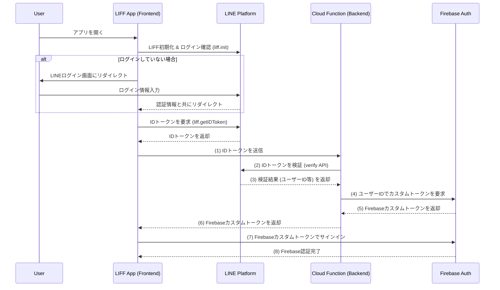

# 認証フロー

本システムでは、以下の認証フローでLINEユーザーとFirebaseを連携している。

1.  **LIFFアプリからのIDトークン取得**: LIFFアプリの`useAuth`カスタムフック (`liff/liff-app/src/hooks/useAuth.js`) が、LINE SDKを通じてLINE IDトークンを取得する。
2.  **Cloud Functionsでのカスタムトークン生成**: 取得したLINE IDトークンはCloud Functionsの`createFirebaseToken`関数 (`cloud/functions/auth.js`) に送信される。
3.  **IDトークンの検証とFirebase認証**: Cloud FunctionsはLINEサーバーでIDトークンを検証し、トークンからLINEユーザーIDを抽出する。このLINEユーザーIDをFirebaseのUIDとして使用し、Firebaseカスタムトークンを生成する。
4.  **Firebaseへのサインイン**: LIFFアプリはCloud Functionsから受け取ったFirebaseカスタムトークンを使用してFirebase Authenticationにサインインする。これにより、Firebaseのユーザー認証が確立され、FirebaseのUIDはLINEユーザーIDと同一になる。
5.  **Firestoreアクセス制御**: Firestoreのセキュリティルール (`firestore.rules`) は、このFirebase UID（LINEユーザーID）に基づいてユーザーごとのデータアクセスを制御する。各ユーザーは自身のLINEユーザーIDに対応するFirestoreドキュメントのみを読み書きできる（例: `/users/{lineUserId}`）。

